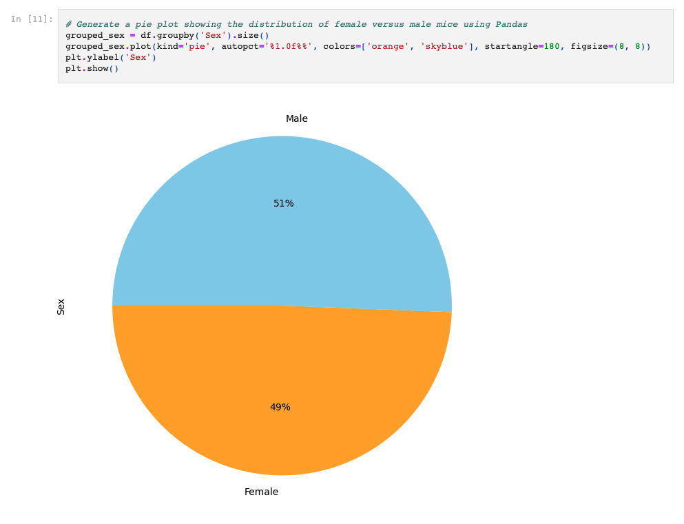

# data-visualization

The goal for this assignment was to compare the effectiveness of different medications used on 249 mice. We are here to determine if Capomulin is the best choice for tumor reduction.

To complete the assignment, I used examples from our lessons and the Xpert Learning Assistant.

